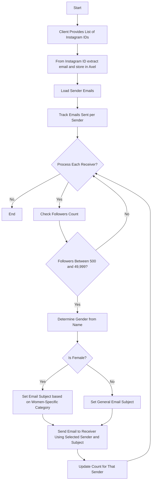

# mailSender

Emailer: Targeted Email Sender for Instagram IDs
This is a command-line application written in Go that processes a list of Instagram IDs, extracts emails, checks follower counts, determines gender, and sends targeted emails based on the logic defined in the provided flowchart. It simulates email sending and Instagram API interactions for demonstration purposes.
Prerequisites

Go: Version 1.22 or later. Download here.
Git: For cloning the repository (optional).

Installation

Clone the RepositoryClone this repository to your local machine.  
git clone https://github.com/TahaAmir/maile-sender.git
cd maile-sender

Initialize Go ModuleSet up the Go module for the project.  
go mod init maile-sender

Build the ApplicationCompile the application to create an executable.  
go build -o maile-sender

Prepare Input FileCreate a text file (e.g., ids.txt) with Instagram IDs, one per line.Example ids.axel:
alice
bob
emma
david

Usage

Run the ApplicationExecute the CLI tool with the input file.  
./maile-sender ids.axel

On Windows: .\maile-sender ids.axel

View OutputThe application processes IDs, simulates email sending, and displays sender email counts.Example output:
Sending email from sender1@example.com to alice@example.com with subject: Exclusive Offer for Women
Sending email from sender1@example.com to bob@example.com with subject: General Offer
Processing complete. Sender counts:
sender1@example.com: 2 emails sent
sender2@example.com: 0 emails sent

Flowchart Steps
Below is the logic of the application based on the provided flowchart, with each step explained in two lines.

StartThe application begins processing when invoked via the CLI.It expects an input file with Instagram IDs.

Client Provides List of Instagram IDsThe user supplies a text file containing Instagram IDs, one per line.The application reads these IDs for further processing.

From Instagram ID Extract Email and Store in AxelEach Instagram ID is used to fetch email and other details (simulated here).Details are stored in an in-memory map simulating the "Axel" database.

Load Sender EmailsPredefined sender email accounts are loaded for sending emails.Each sender tracks the number of emails sent.

Track Emails Sent per SenderThe application maintains a count of emails sent by each sender.This ensures balanced usage of sender accounts.

Process Each Receiver?The application iterates through each receiver in the database.If no receivers remain, the process ends.

Check Followers CountThe follower count for each receiver is checked (simulated).Only receivers with 500–49,999 followers proceed.

Followers Between 500 and 49,999?If the follower count is within the range, proceed to gender check.Otherwise, skip to the next receiver.

Determine Gender from NameThe receiver’s name is analyzed to infer gender (simulated with a suffix rule).This determines the email subject line.

Is Female?The application checks if the receiver is identified as female.This branches to either a women-specific or general email subject.

Set Email Subject Based on Women-Specific CategoryFor female receivers, a women-specific subject (e.g., "Exclusive Offer for Women") is set.This targets the email content to the audience.

Set General Email SubjectFor non-female receivers, a general subject (e.g., "General Offer") is set.This ensures a fallback for other receivers.

Send Email to Receiver Using Selected Sender and SubjectAn email is sent (simulated) using a selected sender and the chosen subject.The email is logged to the console for verification.

Update Count for That SenderThe sender’s email count is incremented after sending.This tracks usage for load balancing.

EndThe process terminates when all receivers are processed.Final sender email counts are displayed.

# Email Sending Flow

