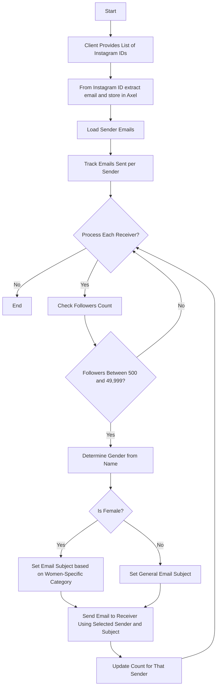

# mailSender

# Email Sending Flow

```mermaid
graph TD
    A[Start] --> B[Client Provides List of Instagram IDs]
    B --> C[From Instagram ID extract email and store in Axel]
    C --> D[Load Sender Emails]
    D --> E[Track Emails Sent per Sender]
    E --> F{Process Each Receiver?}
    F -->|No| Z[End]
    F -->|Yes| G[Check Followers Count]
    G --> H{Followers Between 500 and 49,999?}
    H -->|No| F
    H -->|Yes| I[Determine Gender from Name]
    I --> J{Is Female?}
    J -->|Yes| K[Set Email Subject based on Women-Specific Category]
    J -->|No| L[Set General Email Subject]
    K --> M[Send Email to Receiver Using Selected Sender and Subject]
    L --> M
    M --> N[Update Count for That Sender]
    N --> F
```
